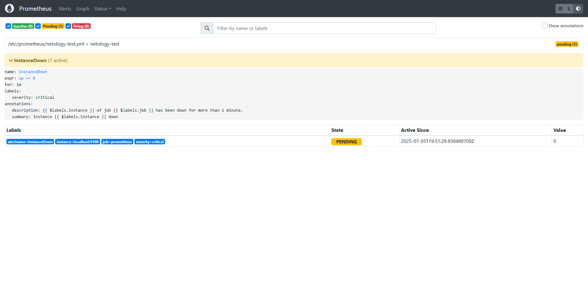
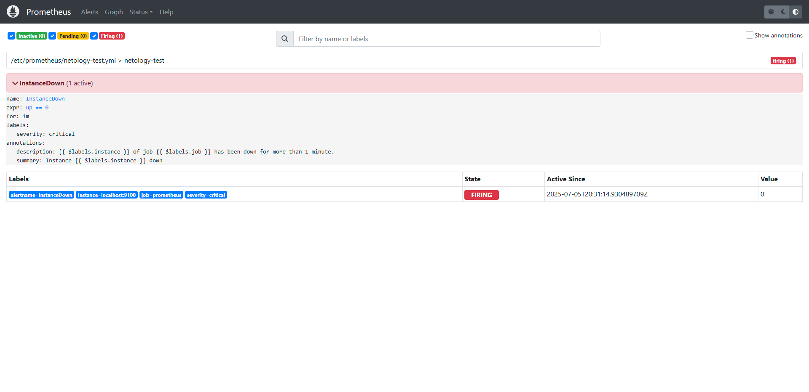
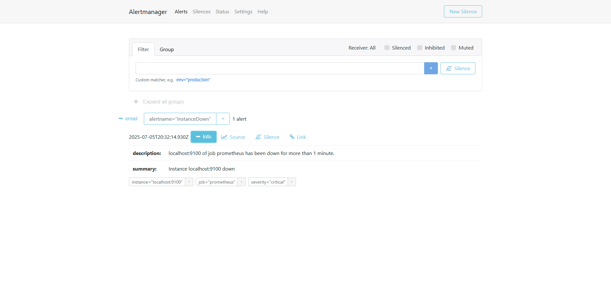
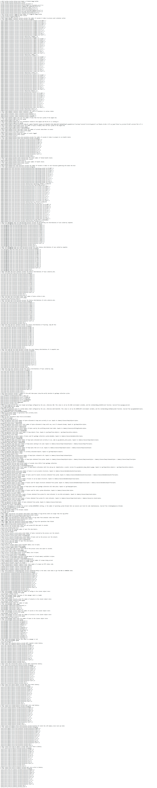
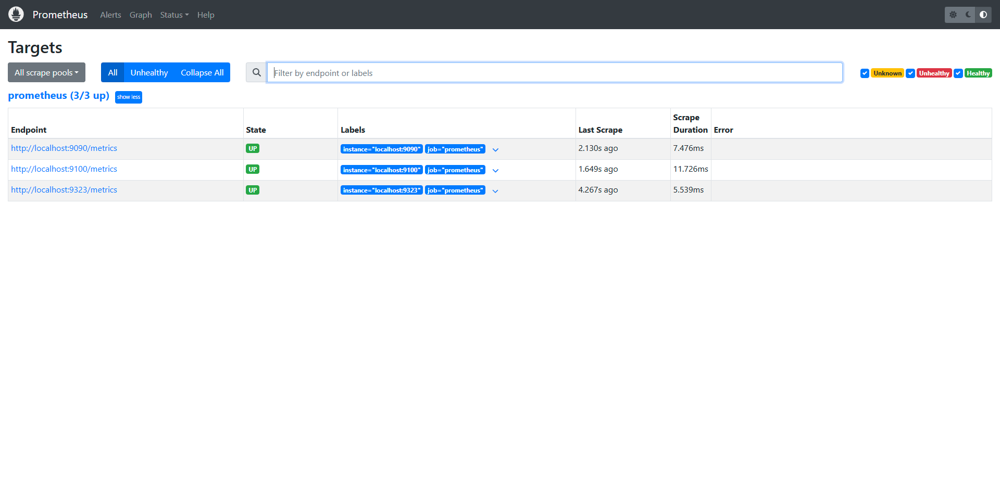
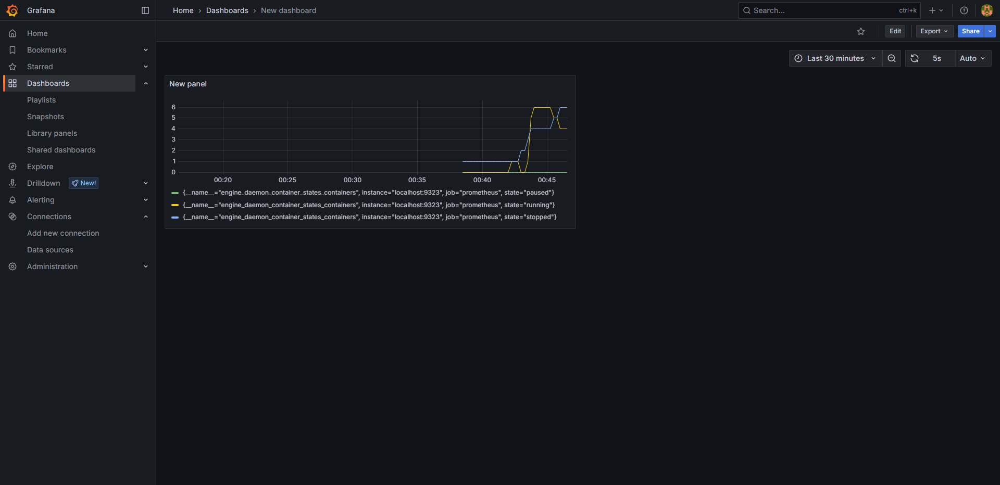

# Домашнее задание к занятию «Prometheus. Часть 2» - Дьяков Владимир

### Задание 1

Создайте файл с правилом оповещения, как в лекции, и добавьте его в конфиг Prometheus.

**Решение**

---

### Задание 2

Установите Alertmanager и интегрируйте его с Prometheus.

**Решение**

---

### Задание 3

Активируйте экспортёр метрик в Docker и подключите его к Prometheus.

**Решение**

---

### Задание 4*

Создайте свой дашборд Grafana с различными метриками Docker и сервера, на котором он стоит.

**Решение**

